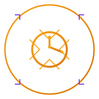

<div align="center">



# powerglide

**The CLI coding agent that slides**

[](https://ziglang.org/)
[](https://github.com/bkataru/powerglide/actions/workflows/ci.yml)
[](LICENSE)
[](https://github.com/bkataru/powerglide)

*Zig-powered multi-agent harness for extreme coding workflows. Built for speed, reliability, and precision. Named after the legendary Lamborghini transmission. 🦀⚡*

</div>

---

## What is powerglide?

**powerglide** is a high-performance CLI coding agent runtime built in [Zig 0.15.2](https://ziglang.org/). It provides a robust, fault-tolerant execution layer for LLM swarms, designed specifically for autonomous coding tasks that require high throughput and verifiable correctness.

Unlike open-ended agent loops that can drift or hang, powerglide is built around the **Ralph Loop** — an explicit 11-state machine that ensures every step is auditable, every tool call is isolated in its own PTY, and every session terminates with a clear protocol signal.

```bash
$ powerglide run --agent hephaestus --velocity 2.0 "refactor the auth module to use the new session manager"
```

---

## Core Pillars

- **The Ralph Loop** 🔄 — An explicit state machine (`idle → load_tasks → pick_task → thinking → tool_call → executing → observing → verify → commit → done`) that sequences cognition and action. No silent failures, no implicit transitions.
- **Velocity Control** 🚀 — Precision control over agent throughput. Velocity is a floating-point multiplier (f64) on a 1000ms base delay (`delay_ms = 1000 / velocity`). Default is `1.0` (1000ms). Speed up (`--velocity 2.0` = 500ms) or slow down (`--velocity 0.5` = 2000ms) as needed.
- **Reliable PTYs** 💻 — Every tool execution happens in a real pseudoterminal. Exit codes are captured via `waitpid` with a `/proc` fallback, ensuring that `zig build` or `pytest` results are 100% reliable.
- **Rogue Agent Prevention** 🛡️ — Defense in depth with step limits, heartbeat monitoring, circuit breakers for repeat tool calls, and budget tracking. Rogue agents are killed before they can damage your codebase.
- **Multi-Model Routing** 🤖 — Native support for Anthropic (Claude), OpenAI, and any OpenAI-compatible endpoint. Automatic fallback chains ensure that rate limits don't stop your workflow.

---

## Quick Start

### Prerequisites

- [Zig 0.15.2](https://ziglang.org/download/) — `mise install zig@0.15.2` or from official binaries.
- An API key for your provider (set `ANTHROPIC_API_KEY` or `OPENAI_API_KEY`).

### Build

```bash
git clone https://github.com/bkataru/powerglide
cd powerglide
zig build
```

The static binary is located at `./zig-out/bin/powerglide`.

### Run

```bash
# Verify system health and API keys
./zig-out/bin/powerglide doctor

# Launch a new agent session
./zig-out/bin/powerglide run "implement a binary search tree in Zig"

# Run at double speed
./zig-out/bin/powerglide run --velocity 2.0 "add comprehensive unit tests"

# Open the multi-agent TUI dashboard
./zig-out/bin/powerglide tui
```

---

## CLI Reference

| Command | Purpose |
|---------|---------|
| `run` | Launch a coding agent session |
| `session` | Manage sessions (list, resume, show, delete) |
| `agent` | Manage agent configurations (hephaestus, artistry, deep) |
| `swarm` | Orchestrate parallel worker swarms |
| `config` | View and modify global configuration |
| `tools` | List and test available MCP-style tools |
| `tui` | Launch the multi-panel dashboard |
| `doctor` | Run system health checks |

Run `powerglide [command] --help` for detailed options.

---

## Why powerglide?

Coding agents are like high-performance cars. Most current harnesses feel like driving a prototype without a dashboard. **powerglide** gives you the wheel, the telemetry, and the transmission built for drag racing.

- **Fast**: Written in Zig, compiles to a single static binary. Zero runtime dependencies.
- **Observable**: Real-time TUI shows exactly what the agent is thinking and doing.
- **Safe**: Built-in guards prevent runaway token usage and recursive tool loops.
- **Extensible**: Add new tools or agents via simple JSON configuration.

---

## For AI Agents

Powerglide is designed to be wielded by other agents. See [AGENTS.md](AGENTS.md) for the protocol specification and integration guide.

## Documentation

Full documentation is available at [bkataru.github.io/powerglide](https://bkataru.github.io/powerglide).

## License

MIT © [bkataru](https://github.com/bkataru)
