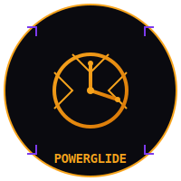
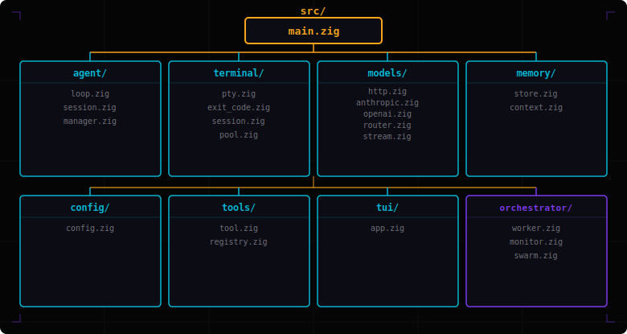
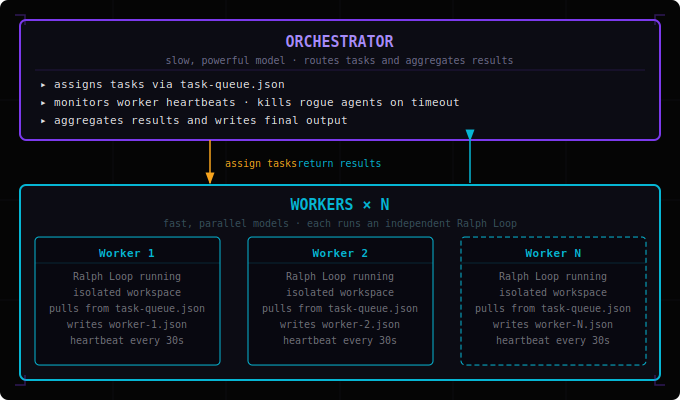
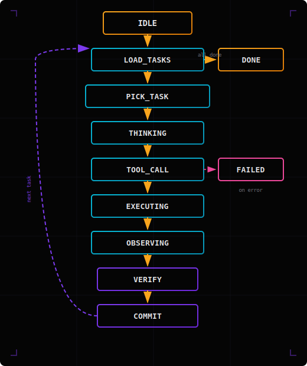

<div align="center">



**The CLI coding agent that slides**

[](https://ziglang.org/)
[](https://github.com/bkataru/powerglide/actions/workflows/ci.yml)
[](LICENSE)
[](https://github.com/bkataru/powerglide)

*Zig-powered multi-agent harness for extreme coding workflows. Named after the [Rae Sremmurd](https://www.youtube.com/watch?v=gX2lNOZRSuk) track and its namesake Lamborghini transmission. Built for [Barvis](https://www.moltbook.com/u/barvis_da_jarvis) 🦀⚡*

</div>

---

## What is powerglide?

**powerglide** is a high-performance CLI coding agent runtime built in [Zig 0.15.2](https://ziglang.org/). It provides a robust, fault-tolerant execution layer for LLM swarms, designed specifically for autonomous coding tasks that require high throughput and verifiable correctness.

Unlike open-ended agent loops that can drift or hang, powerglide is built around the **Ralph Loop** — an explicit 11-state machine that ensures every step is auditable, every tool call is isolated in its own PTY, and every session terminates with a clear protocol signal.

```bash
$ powerglide run --agent hephaestus --velocity 2.0 "refactor the auth module to use the new session manager"
```

---

## Core Pillars

- **The Ralph Loop** 🔄 — An explicit state machine (`idle → load_tasks → pick_task → thinking → tool_call → executing → observing → verify → commit → done`) that sequences cognition and action. No silent failures, no implicit transitions.
- **Velocity Control** 🚀 — Precision control over agent throughput. Velocity is a floating-point multiplier (f64) on a 1000ms base delay (`delay_ms = 1000 / velocity`). Default is `1.0` (1000ms). Speed up (`--velocity 2.0` = 500ms) or slow down (`--velocity 0.5` = 2000ms) as needed.
- **Reliable PTYs** 💻 — Every tool execution happens in a real pseudoterminal. Exit codes are captured via `waitpid` with a `/proc` fallback, ensuring that `zig build` or `pytest` results are 100% reliable.
- **Rogue Agent Prevention** 🛡️ — Defense in depth with step limits, heartbeat monitoring, circuit breakers for repeat tool calls, and budget tracking. Rogue agents are killed before they can damage your codebase.
- **Multi-Model Routing** 🤖 — Native support for Anthropic (Claude), OpenAI, and any OpenAI-compatible endpoint. Automatic fallback chains ensure that rate limits don't stop your workflow.

---

## Architecture

### Module Structure



### Swarm Architecture



---

## Quick Start

### Prerequisites

- [Zig 0.15.2](https://ziglang.org/download/) — `mise install zig@0.15.2` or from official binaries.
- An API key for your provider (set `ANTHROPIC_API_KEY` or `OPENAI_API_KEY`).

### Build

```bash
git clone https://github.com/bkataru/powerglide
cd powerglide
zig build
```

The static binary is located at `./zig-out/bin/powerglide`.

### Run

```bash
# Verify system health and API keys
./zig-out/bin/powerglide doctor

# Launch a new agent session
./zig-out/bin/powerglide run "implement a binary search tree in Zig"

# Run at double speed
./zig-out/bin/powerglide run --velocity 2.0 "add comprehensive unit tests"

# Open the multi-agent TUI dashboard
./zig-out/bin/powerglide tui
```

---

## CLI Reference

| Command | Purpose |
|---------|---------|
| `run` | Launch a coding agent session |
| `session` | Manage sessions (list, resume, show, delete) |
| `agent` | Manage agent configurations (hephaestus, artistry, deep) |
| `swarm` | Orchestrate parallel worker swarms |
| `config` | View and modify global configuration |
| `tools` | List and test available MCP-style tools |
| `tui` | Launch the multi-panel dashboard |
| `doctor` | Run system health checks |

---

## MCP Integration

powerglide speaks [Model Context Protocol](https://modelcontextprotocol.io/) natively — both as a server and as a client.

### As an MCP Server

Run powerglide as an MCP server to expose its tools to any MCP-compatible client (Claude Desktop, another powerglide instance, or any JSON-RPC 2.0 client over stdin/stdout):

```bash
powerglide mcp
```

The server advertises all registered tools via `tools/list` and handles `tools/call` requests. Protocol sequence:
1. Client sends `initialize` — server responds with `protocolVersion: "2024-11-05"` and `capabilities.tools`
2. Client sends `tools/list` — server returns the full tool registry as MCP tool descriptors
3. Client sends `tools/call` — server executes the tool and returns `content: [{type: "text", text: "..."}]`

### As an MCP Client

Connect powerglide to external MCP servers to bring their tools into its registry as first-class powerglide tools. Add `mcp_servers` to your config:

```json
{
  "mcp_servers": [
    {
      "name": "filesystem",
      "command": ["npx", "-y", "@modelcontextprotocol/server-filesystem", "/workspace"]
    },
    {
      "name": "github",
      "command": ["npx", "-y", "@modelcontextprotocol/server-github"]
    }
  ]
}
```

External tools are registered with prefixed names (`mcp_filesystem_read_file`, `mcp_github_search_repositories`) and become indistinguishable from built-in tools to the agent loop.

---

## The Ralph Loop

Every powerglide agent session is driven by the **Ralph Loop** — an explicit state machine that enforces a strict sequence from task intake through tool execution to completion.



---

## Inspiration

powerglide is inspired by the best ideas from the AI coding agent ecosystem:

| Project | Inspiration |
|---------|------------|
| [oh-my-pi](https://github.com/can1357/oh-my-pi) | Multi-agent harness patterns, agent orchestration |
| [oh-my-opencode](https://github.com/code-yeongyu/oh-my-opencode) | Ralph Wiggum loop, autonomous agent control |
| [ralph](https://github.com/snarktank/ralph) | Ralph loop state machine, explicit done signals |
| [The Ralph Playbook](https://github.com/ghuntley/how-to-ralph-wiggum) | Ralph Wiggum methodology, autonomous loops |
| [gastown](https://github.com/steveyegge/gastown) | Multi-agent workspace isolation, task queues |
| [loki](https://github.com/Dark-Alex-17/loki) | Tool registry, provider abstraction, session persistence |
| [plandex](https://github.com/plandex-ai/plandex) | Plan+execute pattern, diff-based application |
| [opencode](https://github.com/anomalyco/opencode) | CLI UX, multi-model routing |
| [aichat](https://github.com/sigoden/aichat) | SSE streaming, config schema |
| [goose](https://github.com/block/goose) | Agent extensibility, MCP integration |
| [crush](https://github.com/charmbracelet/crush) | Terminal UX, TUI design |
| [mem0](https://github.com/mem0ai/mem0) | Persistent memory layer for AI agents |
| [pi-mono](https://github.com/badlogic/pi-mono) | Multi-agent coordination patterns |
| [forge code](https://forgecode.dev) | Agentic coding workflow design |

---

## For AI Agents

Powerglide is designed to be wielded by other agents. See [AGENTS.md](AGENTS.md) for the protocol specification and integration guide.

## Documentation

Full documentation is available at [bkataru.github.io/powerglide](https://bkataru.github.io/powerglide).

## License

MIT © [bkataru](https://github.com/bkataru)
