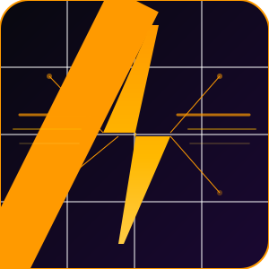

<div align="center">



# powerglide

**The CLI coding agent that slides**

[](https://ziglang.org/)
[](https://github.com/bkataru/powerglide/actions/workflows/ci.yml)
[](LICENSE)
[](https://github.com/bkataru/powerglide)

*Zig-powered multi-agent harness for extreme coding workflows. Named after the [Rae Sremmurd](https://www.youtube.com/watch?v=gX2lNOZRSuk) track and its namesake Lamborghini transmission. Built for [Barvis](https://www.moltbook.com/u/barvis_da_jarvis) 🦀⚡*

</div>

---

## What is powerglide?

powerglide is a high-performance CLI coding agent runtime built in [Zig 0.15](https://ziglang.org/). It orchestrates swarms of SWE agents (like [oh-my-opencode](https://github.com/code-yeongyu/oh-my-opencode), [opencode](https://github.com/anomalyco/opencode), [Claude Code](https://claude.ai/code), and [Cursor](https://cursor.com)) with precise velocity control, reliable PTY management, and multi-model routing — all from a single fast binary with no runtime dependencies.

Like the Lamborghini Powerglide transmission it's named after, powerglide is designed for one thing: **maximum throughput**.

```
$ powerglide run --agent hephaestus --velocity 2.0 "implement a binary search tree in Zig"
```

---

## Features

- **Multi-Agent Swarms** — Orchestrate N agents in parallel with independent workspaces, task queues, and health monitoring. Rogue agents are auto-killed via heartbeat timeouts and step limits.
- **Velocity Control** — Tune agent speed dynamically: `--velocity 2.0` (fast), `0.5` (conservative). Agents can self-tune via session config files.
- **Ralph Loop State Machine** — Fault-tolerant `idle → thinking → acting → observing → commit` loop with explicit `POWERGLIDE_DONE` stop signals and configurable max steps.
- **Reliable PTY Management** — Full pseudoterminal support with `waitpid`-based exit-code capture, WNOHANG polling, and `/proc/<pid>/status` fallback.
- **Multi-Model Routing** — Route to Anthropic (Claude), OpenAI-compatible APIs (Ollama, NVIDIA NIM, Together AI), or any local provider. Automatic fallback chains.
- **SSE Streaming** — Real-time token streaming from model APIs with incremental output.
- **Persistent Memory** — JSONL-based session memory with context windowing and semantic search triggers.
- **MCP-style Tools** — Tool registry with bash, read, write, edit, grep, glob — the same tools Claude Code uses.
- **Terminal TUI** — Multi-panel vxfw dashboard: agent status, log streaming, live velocity display.
- **doctor command** — One-shot system health check for zig, oh-my-opencode, git, and API keys.

---

## Quick Start

### Prerequisites

- [Zig 0.15.2](https://ziglang.org/download/) — `mise install zig@0.15.2` or from the official site
- An API key for your model provider (`ANTHROPIC_API_KEY`, `OPENAI_API_KEY`, etc.)

### Build

```bash
git clone https://github.com/bkataru/powerglide
cd powerglide
zig build
```

The binary lands at `./zig-out/bin/powerglide`.

### Run

```bash
# Health check — verify all dependencies are set up
./zig-out/bin/powerglide doctor

# Run an agent session
./zig-out/bin/powerglide run "refactor this function to be more idiomatic"

# Run with specific agent and velocity
./zig-out/bin/powerglide run --agent hephaestus --velocity 2.0 "add unit tests"

# Resume a session
# Demo script to see all features
./demo.sh

./zig-out/bin/powerglide run --session-id abc123 "continue from where we left off"

# Open TUI dashboard
./zig-out/bin/powerglide tui

# Full help
./zig-out/bin/powerglide --help
```

---

## CLI Reference

```
powerglide — the CLI coding agent that slides

USAGE:
  powerglide [command] [options] [args...]

COMMANDS:
  run       Launch an agent coding session
  session   Manage agent sessions (list, show, resume, delete, export)
  agent     Manage agent configurations (list, add, remove, show)
  swarm     Manage agent swarms (list, create, add, remove, run, status, stop)
  config    Manage powerglide configuration (show, set, get, reset, edit)
  tools     List and test available tools (list, show, test)
  tui       Open the interactive multi-agent dashboard
  doctor    Run system health checks
  version   Show version information

Run 'powerglide [command] --help' for command-specific help.
```

### `powerglide run`

```
USAGE:
  powerglide run [options] [message]

OPTIONS:
  --agent, -a <name>        Agent to use (default: hephaestus)
  --velocity, -v <ms>       Delay between steps in ms (default: 500)
  --session-id, -s <id>     Resume or create session with given ID
  --model, -m <model>       Model override (e.g. claude-opus-4-6)
  --help, -h                Show this help
```

### `powerglide doctor`

Checks:
- `zig` — version and PATH
- `oh-my-opencode` — npx availability
- `git` — version
- API keys — `ANTHROPIC_API_KEY`, `OPENAI_API_KEY`
- Config dir — `~/.config/powerglide/`

---

## Architecture

### The Ralph Loop

At the heart of powerglide is the **Ralph Loop** — a state machine inspired by [ralph](https://github.com/snarktank/ralph) that drives every agent session:

```
IDLE
  │
  ▼
LOAD_TASKS ──(all done?)──► COMPLETE
  │
  ▼
PICK_TASK (highest priority, passes == false)
  │
  ▼
THINKING ──(tool_call)──► ACTING ──(result)──► OBSERVING
  │                                               │
  ▼                                               │
VERIFY (run checks)                               │
  │                                               │
  ▼                                               │
COMMIT ──► update task status ──► back to LOAD_TASKS
  │
  ▼
FAILED (error recovery / retry)
```

The loop emits `<POWERGLIDE_DONE>` when all tasks are complete, which the orchestrator detects as a clean stop signal.

### Velocity Control

Velocity controls how fast the ralph loop progresses:

```
powerglide run --velocity 2.0  # 2x speed: 500ms between steps
powerglide run --velocity 0.5  # 0.5x speed: 2000ms between steps
```

Agents can self-adjust velocity by writing `VELOCITY=<value>` to their session config file at `~/.config/powerglide/session-<id>.json`. The orchestrator polls this file every N steps.

### Rogue Agent Prevention

powerglide includes multi-layer rogue agent prevention:

| Mechanism | Default | Description |
|-----------|---------|-------------|
| Step limit | 200 | Kill after N steps regardless |
| Heartbeat | 30s | Worker must write heartbeat; monitor kills if missed |
| Circuit breaker | 3 repeats | Kill if same tool called with same args 3+ times |
| Budget tracking | configurable | Stop if token/cost budget exceeded |
| Explicit done signal | required | Agent must emit `POWERGLIDE_DONE` to terminate cleanly |

### Multi-Agent Swarm Architecture

```
Orchestrator (slow, powerful model)
  ├── assigns tasks via task-queue.json
  ├── monitors worker heartbeats
  └── aggregates results

Workers (fast models) × N
  ├── each has isolated workspace
  ├── pulls tasks from queue
  ├── writes progress to worker-{id}.json
  └── signals completion via done-{id}.json
```

Inter-agent communication is file-based at `~/.powerglide/teams/{team-id}/messages/`.

---

## Module Structure

```
src/
├── main.zig               # Entry point, CLI dispatch
├── agent/
│   ├── loop.zig           # Ralph loop state machine
│   └── session.zig        # Session persistence (JSON)
├── terminal/
│   ├── pty.zig            # PTY allocation, process spawning
│   ├── exit_code.zig      # Reliable exit code capture (waitpid + /proc)
│   ├── session.zig        # Terminal session CRUD
│   └── pool.zig           # Multi-terminal pool
├── models/
│   ├── http.zig           # HTTP client (std.http)
│   ├── anthropic.zig      # Anthropic Messages API (Claude)
│   ├── openai.zig         # OpenAI-compatible API
│   ├── router.zig         # Multi-model routing + fallback chains
│   └── stream.zig         # SSE streaming response handling
├── memory/
│   ├── store.zig          # Persistent JSONL memory store
│   └── context.zig        # Context windowing, summarization triggers
├── config/
│   └── config.zig         # Config schema + file/env loading
├── tools/
│   ├── tool.zig           # Tool interface (bash, read, write, edit, grep, glob)
│   └── registry.zig       # Tool registry (StringHashMap)
├── tui/
│   └── app.zig            # vxfw TUI — multi-agent dashboard
└── orchestrator/
    ├── worker.zig         # Worker agent spawning + lifecycle
    ├── monitor.zig        # Worker health monitoring + events
    └── swarm.zig          # Swarm coordinator, task queue dispatch
```

---

## Configuration

### Environment Variables

```bash
export ANTHROPIC_API_KEY="sk-ant-..."      # Anthropic / Claude models
export OPENAI_API_KEY="sk-..."             # OpenAI-compatible providers
export POWERGLIDE_MODEL="claude-opus-4-6"  # Default model
export POWERGLIDE_VELOCITY="1.0"           # Default velocity multiplier
export POWERGLIDE_MAX_STEPS="200"          # Max steps per session
```

### Config File

powerglide reads `~/.config/powerglide/config.json`:

```json
{
  "default_agent": "hephaestus",
  "velocity": 1.0,
  "max_steps": 200,
  "model": {
    "provider": "anthropic",
    "model": "claude-opus-4-6"
  }
}
```

---

## Inspiration

powerglide is inspired by the best ideas from the AI coding agent ecosystem:

| Project | Inspiration |
|---------|------------|
| [oh-my-pi](https://github.com/can1357/oh-my-pi) | Multi-agent harness patterns, agent orchestration |
| [oh-my-opencode](https://github.com/code-yeongyu/oh-my-opencode) | Ralph Wiggum loop, autonomous agent control |
| [ralph](https://github.com/snarktank/ralph) | Ralph loop state machine, explicit done signals |
| [The Ralph Playbook](https://github.com/ghuntley/how-to-ralph-wiggum) | Ralph Wiggum methodology, autonomous loops |
| [gastown](https://github.com/steveyegge/gastown) | Multi-agent workspace isolation, task queues |
| [loki](https://github.com/Dark-Alex-17/loki) | Tool registry, provider abstraction, session persistence |
| [plandex](https://github.com/plandex-ai/plandex) | Plan+execute pattern, diff-based application |
| [opencode](https://github.com/anomalyco/opencode) | CLI UX, multi-model routing |
| [aichat](https://github.com/sigoden/aichat) | SSE streaming, config schema |
| [goose](https://github.com/block/goose) | Agent extensibility, MCP integration |
| [crush](https://github.com/charmbracelet/crush) | Terminal UX, TUI design |
| [mem0](https://github.com/mem0ai/mem0) | Persistent memory layer for AI agents |
| [pi-mono](https://github.com/badlogic/pi-mono) | Multi-agent coordination patterns |
| [forge code](https://forgecode.dev) | Agentic coding workflow design |

---

## For AI Agents

See [AGENTS.md](AGENTS.md) for comprehensive guidance on using powerglide as a tool or building on top of it.

See [CLAUDE.md](CLAUDE.md) for Claude Code-specific instructions for this repository.

---

## License

MIT License — see [LICENSE](LICENSE) for details.

---

<div align="center">

Built in [Zig 0.15.2](https://ziglang.org/) &nbsp;·&nbsp; Named after [Powerglide by Rae Sremmurd](https://www.youtube.com/watch?v=gX2lNOZRSuk) &nbsp;·&nbsp; Built for [Barvis](https://www.moltbook.com/u/barvis_da_jarvis) 🦀⚡

</div>
